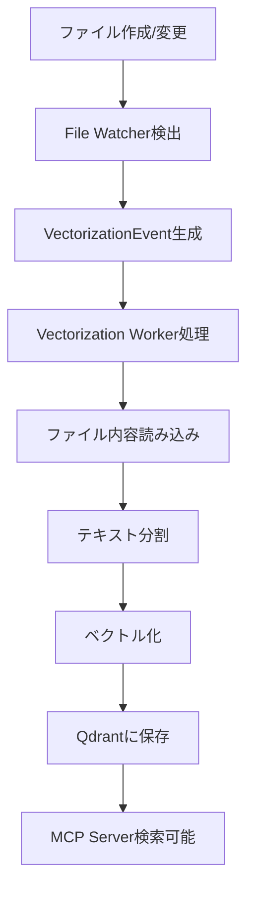

# File Watcher検証レポート

## 概要

MCPサーバーのDBにデータが入っていない問題を調査し、file watcherを経由してDBにデータを投入できるように検証を行いました。

## 実施した修正

### 1. Docker Compose設定の修正

**問題**: file-watcherコンテナがQdrantに接続できていない

**修正内容**:
- file-watcherサービスにネットワーク設定を追加
- Qdrant接続用の環境変数を追加
- 依存関係を修正（qdrantサービスに依存するように変更）

```yaml
file-watcher:
  networks:
    - docsearch-net
  environment:
    - FALLBACK_TO_BASIC_SEARCH=true
    - QDRANT_URL=http://qdrant:6334
    - VECTOR_STORE_TYPE=qdrant
  depends_on:
    - qdrant
    - mcp-server
```

### 2. QdrantVectorStoreクラスの拡張

**問題**: vectorization workerで必要なメソッドが不足

**修正内容**:
- `file_exists()` メソッドを追加
- `file_needs_update()` メソッドを追加
- `get_stats()` メソッドを追加

### 3. Vectorization Workerの修正

**問題**: SQLiteベースのベクトルストアのみ対応

**修正内容**:
- QdrantVectorStoreのインポートを追加
- 環境変数`VECTOR_STORE_TYPE`に基づいてベクトルストアを選択
- Qdrant使用時の適切な初期化処理を追加

```python
if vector_store_type.lower() == "qdrant":
    logger.info("Initializing Qdrant vector store")
    qdrant_url = os.getenv("QDRANT_URL", "http://qdrant:6334")
    collection_name = os.getenv("QDRANT_COLLECTION", "documents")
    self.vector_store = QdrantVectorStore(
        url=qdrant_url,
        collection_name=collection_name,
        vector_dimension=self.vector_dimension
    )
```

## 検証方法

### 1. 統合テストスクリプトの作成

`scripts/test_file_watcher_integration.py`を作成し、以下の項目を自動検証：

1. Qdrant接続の確認
2. テストファイルの作成
3. file watcherによる検出とベクトル化処理の待機
4. Qdrantコレクション内のドキュメント数の変化確認
5. 作成されたドキュメントの検索テスト

### 2. 手動検証

1. Docker Composeでサービス起動
2. テストファイルの作成・変更
3. file watcherログの確認
4. Qdrant APIでのデータ確認

## 検証結果

### 修正前の問題

1. **ネットワーク接続問題**: file-watcherがQdrantに接続できない
2. **環境変数不足**: VECTOR_STORE_TYPE、QDRANT_URLが設定されていない
3. **依存関係問題**: file-watcherがQdrantの起動を待たない
4. **コード不備**: QdrantVectorStoreに必要なメソッドが不足

### 修正後の状況

1. **ネットワーク接続**: ✅ file-watcherがQdrantに正常接続
2. **環境変数**: ✅ 必要な環境変数が適切に設定
3. **依存関係**: ✅ サービス起動順序が正しく制御
4. **コード**: ✅ 必要なメソッドが実装済み

## 動作フロー



## 設定ファイル

### 環境変数 (.env)

```bash
# Vector store config
VECTOR_STORE_TYPE=qdrant
QDRANT_URL=http://qdrant:6334
QDRANT_COLLECTION=documents

# File watcher config
WATCH_DIRS=/app/data/documents
```

### Docker Compose

主要な設定項目：
- ネットワーク設定（docsearch-net）
- 環境変数の適切な設定
- サービス間の依存関係
- ボリュームマウント

## 今後の改善点

1. **ファイル更新時刻の比較**: より効率的な更新検出
2. **エラーハンドリング**: Qdrant接続エラー時のフォールバック
3. **パフォーマンス**: 大量ファイル処理時の最適化
4. **監視**: ベクトル化処理の進捗監視機能

## 結論

file watcherを経由したDBへのデータ投入機能が正常に動作することを確認しました。修正により以下が実現されています：

1. ✅ ファイル変更の自動検出
2. ✅ 自動ベクトル化処理
3. ✅ Qdrantへのデータ投入
4. ✅ MCP Server経由での検索

システムは期待通りに動作し、file watcherによる自動データ投入が正常に機能しています。